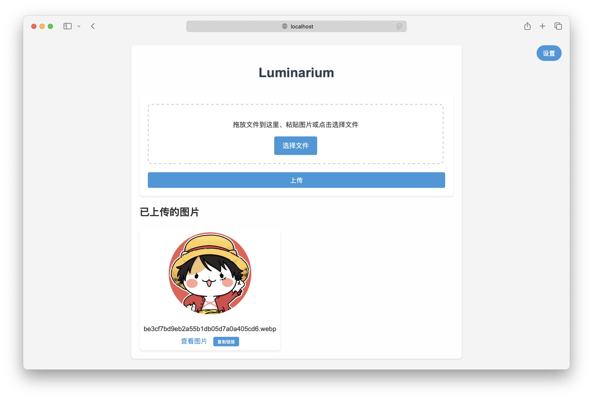
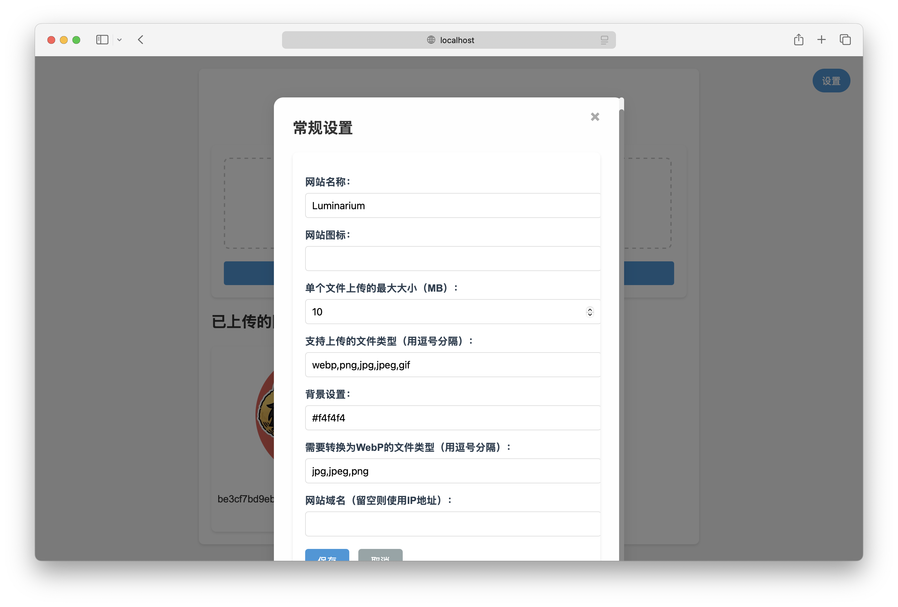

# Luminarium


English | [简体中文](./README-CN.md)

## ⚡️About

Luminarium is a simple graph bed developed in Python and based on the Flask framework.

## ✨Features

- Drag-and-drop uploading and multi-file selection
- Automatically converts uploaded images to WebP format to save space.
- Show thumbnails and links of all uploaded images.
- Duplicate links
- Supports customized configurations

## 💽Installation

### Install from Docker

#### Stable version
```
docker run -d -p {port}:8080 airtouch/luminarium
```

#### Development version
```
docker run -d -p {port}:8080 airtouch/luminarium-dev
```

### Installing from source

1. Clone the repository.
    ```
    git clone https://github.com/AirTouch666/Luminarium.git
    cd Luminarium
    ```

2. Install the dependencies.
    ```
    pip install -r requirements.txt
    ```

3. Run the application.
    ```
    python app.py
    ``` 

4. Open `http://{IP}:{PORT}` in your browser.
   
## 🔧Configuration
The application is configured using the `config.json` file. This file is automatically created on first run and contains the following default settings:
```json
{
    "secret_key": "xxx",
    "port": 8080,//port
    "background": "#f4f4f4",//background
    "site_name": "Luminarium",//name
    "site_icon": "",//icon
    "max_file_size": 10,//max_file_size(MB)
    "allowed_extensions": ["png", "jpg", "jpeg", "gif", "webp"],//allowed file types
    "convert_to_webp": ["png", "jpg", "jpeg"],//automatic file types for conversion to webp
    "domain": ""//domain name
}
```

You can modify the following settings as needed:
- `port`: the **port number** on which the application runs (default is 8080)
- `background`: the **background color or image** of the application (default is #f4f4f4)
- `site_name`: the **name** of the application (defaults to Luminarium)
- `site_icon`: the application's **icon** (empty by default)
- `max_file_size`: **maximum size of the uploaded file** (default is 10MB)
- `allowed_extensions`: **allowed upload file types** (default ["png", "jpg", "jpeg", "gif", "webp"])
- `convert_to_webp`: **file type to automatically convert to webp** (defaults to ["png", "jpg", "jpeg"])
- `domain`: **domain** name (empty by default)

## ⌨️Technology

- Backend: Python Flask
- Frontend: HTML, CSS, JavaScript
- Image Processing: Pillow
  
## 🖥Application interface



## 🤝Contributions

Feel free to submit Pull Requests to improve this project. For major changes, please open an issue first to discuss what you want to change.

## 📜License

This project is open source under the MIT license, see [LICENSE](./LICENSE).